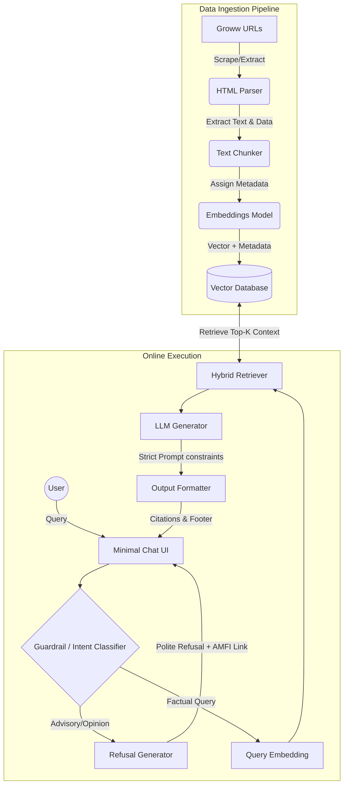

# System Architecture: Mutual Fund FAQ Assistant

## 1. High-Level Architecture Overview
The system follows an advanced Retrieval-Augmented Generation (RAG) architecture tailored specifically for a facts-only, strictly compliant financial domain. It is divided into three primary pipelines:
1. **Data Ingestion & Indexing Pipeline** (Offline)
2. **Query Processing & Guardrails** (Online)
3. **Retrieval & Generation Engine** (Online)

## 2. Component Details

### A. Data Ingestion & Indexing Pipeline
The goal of this pipeline is to extract, clean, and structure the data purely from the chosen Groww mutual fund URLs provided.

- **Data Sources:** 
  - Target Groww scheme URLs (Base Corpus)
- **Data Extractor & Parser:**
  - Extracts text and data directly from HTML (Groww websites).
  - Web scraping tools (e.g., BeautifulSoup, Playwright) are used to parse the specific page structure to accurately capture data like expense ratios, NAV, and exit loads.
- **Chunking Strategy:**
  - Semantic chunking (section-based) rather than simple character count, ensuring that a single chunk contains complete context (e.g., the entire "Exit Load" section of a specific fund).
- **Metadata Tagging:**
  - Every chunk is tagged with metadata: `Scheme_Name`, `Source_URL`, `Document_Type` (e.g., Factsheet), and `Last_Updated_Date`. This is critical for the citation and footer requirements.
- **Embedding & Vector Store:**
  - **Embedding Model:** A financial-domain fine-tuned embedding model or a high-quality general model.
  - **Vector Database:** A fast vector store stores the embeddings alongside the rich metadata.
- **Automated Scheduler:**
  - A GitHub Actions workflow (`daily-ingest.yml`) that triggers the ingestion pipeline every 24 hours.
  - Ensures the vector database is continually refreshed with the latest Expense Ratios, NAVs, and Exit Loads without requiring a persistent background daemon.

### B. Query Processing & Guardrails
This is the most critical component to satisfy the "Facts-Only" and "Refusal Handling" requirements.

- **User Interface:** A minimal UI featuring a welcome message, 3 example questions, and the "Facts-only. No investment advice." disclaimer.
- **Intent Classifier / Guardrail Agent:**
  - Before retrieval, an initial lightweight classification step (or LLM prompt) analyzes the user query.
  - **Advisory/Opinion Queries:** (e.g., "Which fund is better?", "Should I invest?") are immediately intercepted.
  - **Action:** The system bypasses the RAG pipeline and returns a standardized refusal message with an AMFI/SEBI educational link.
  - **Factual Queries:** (e.g., "What is the exit load for HDFC Small Cap?") proceed to the retrieval stage.

### C. Retrieval & Generation Engine
- **Retrieval (Semantic + Lexical):**
  - Uses Hybrid Search (Dense vector search + Keyword BM25) to ensure high recall for specific financial terms (e.g., "Expense Ratio", "SIP").
  - Metadata filters are applied if the system identifies a specific scheme in the user's query.
- **Context Injection:**
  - Top-K relevant chunks are retrieved. The system verifies that the retrieved chunks contain the necessary facts.
- **LLM Generation:**
  - **Prompt Engineering:** The LLM is strictly prompted to:
    1. Base the answer *only* on the provided context.
    2. Keep the answer under 3 sentences.
    3. Output the exact source URL and the last updated date.
- **Post-Processing & Formatting:**
  - The system parses the LLM output, formats the citation, and appends the required footer: `> "Last updated from sources: <date>"`.

## 3. Architecture Diagram (Mermaid)

## 4. Technology Stack (Proposed)
- **Frontend / UI:** Streamlit or Gradio (for rapid, minimal UI development)
- **Orchestration:** LangChain or LlamaIndex
- **Data Parsing:** BeautifulSoup, Playwright, or Puppeteer (for reliable HTML extraction)
- **Vector Database:** ChromaDB (local/lightweight) or Pinecone (managed)
- **Embeddings:** BAAI/bge-large-en (Open-source BGE model)
- **LLM:** Groq (for ultra-fast, strict instruction following)

## 5. Security & Privacy Compliance
- **No PII Collection:** The UI does not implement authentication. No PAN, Aadhaar, phone numbers, or account details are requested or logged.
- **Stateless Architecture:** Chat history is only maintained client-side for the current session. The server does not persist user conversations linked to identities.
- **Read-Only System:** The assistant operates in a purely read-only mode regarding the knowledge base; it cannot execute transactions or modify mutual fund data.
